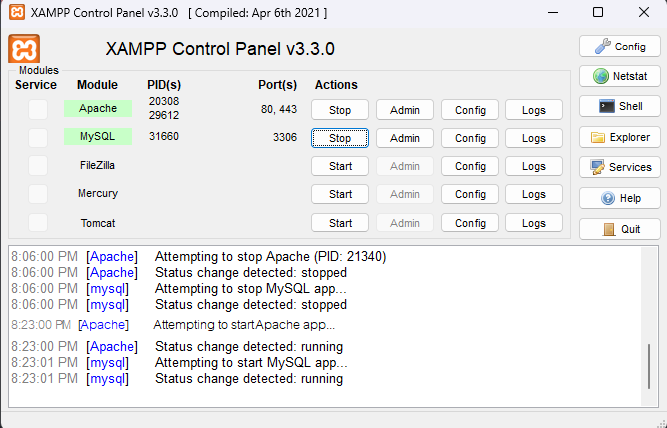
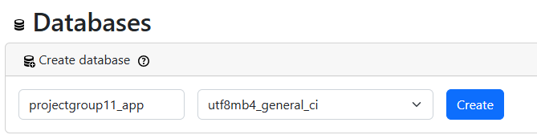

1. clone project-database-laravel
```bash
git clone https://github.com/Project-Database-67-Group11/project-database-laravel
```
2. Install XAMPP(https://www.apachefriends.org/download.html)
3. Install Composer(https://getcomposer.org/download/)
4. เข้าไป Forlder ที่ clone มาแล้ว
```bash
cd ProjectGroup11-appx
```
5. Run คำสั่ง
```bash
composer install
```
```bash
npm install
```
```bash
npm run build
```
6. คำสั่งสร้างไฟล์ .env
```bash
echo.> .env
```
7. ใส่ txt นี้ลงไปใน .env
```bash
APP_NAME=Laravel
APP_ENV=local
APP_KEY=base64:SuAbIeJy5IVG4BcAmUQpwECqXehlkDdSFrQX75rkLmU=
APP_DEBUG=true
APP_TIMEZONE=UTC
APP_URL=http://localhost

APP_LOCALE=en
APP_FALLBACK_LOCALE=en
APP_FAKER_LOCALE=en_US

APP_MAINTENANCE_DRIVER=file
# APP_MAINTENANCE_STORE=database

BCRYPT_ROUNDS=12

LOG_CHANNEL=stack
LOG_STACK=single
LOG_DEPRECATIONS_CHANNEL=null
LOG_LEVEL=debug

DB_CONNECTION=mysql
DB_HOST=127.0.0.1
DB_PORT=3306
DB_DATABASE=projectgroup11_app
DB_USERNAME=root
DB_PASSWORD=

SESSION_DRIVER=database
SESSION_LIFETIME=120
SESSION_ENCRYPT=false
SESSION_PATH=/
SESSION_DOMAIN=null

BROADCAST_CONNECTION=log
FILESYSTEM_DISK=local
QUEUE_CONNECTION=database

CACHE_STORE=database
CACHE_PREFIX=

MEMCACHED_HOST=127.0.0.1

REDIS_CLIENT=phpredis
REDIS_HOST=127.0.0.1
REDIS_PASSWORD=null
REDIS_PORT=6379

MAIL_MAILER=log
MAIL_HOST=127.0.0.1
MAIL_PORT=2525
MAIL_USERNAME=null
MAIL_PASSWORD=null
MAIL_ENCRYPTION=null
MAIL_FROM_ADDRESS="hello@example.com"
MAIL_FROM_NAME="${APP_NAME}"

AWS_ACCESS_KEY_ID=
AWS_SECRET_ACCESS_KEY=
AWS_DEFAULT_REGION=us-east-1
AWS_BUCKET=
AWS_USE_PATH_STYLE_ENDPOINT=false

VITE_APP_NAME="${APP_NAME}"

```
8. Run คำสั่ง
```bash
php artisan key:generate
```
9. เปิด XAMPP กด Start ที่ Apache MySQL
 


10.  เข้าไปที่ (http://localhost/phpmyadmin/index.php?route=/server/databases)
แล้วสร้าง database ที่มีชื่อว่า projectgroup11_app



11. เข้าไปที่ database projectgroup11_app แล้ว IMPORT projectgroup11_app.sql จากใน github

12. Run คำสั่ง
```bash
php artisan serve
```